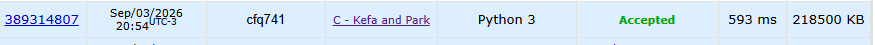

# Marco 4 - Aplicação básica de BFS e conclusão


## Execução Manual

Para demonstrar o funcionamento da BFS (Busca em Largura), utilizaremos o mesmo grafo apresentado no Marco 3.

````mermaid
flowchart TD

    A((1))
    B((2))
    C((3))
    D((4))
    E((5))
    F((6))
    G((7))

    A --- B
    A --- C
    B --- D
    B --- E
    C --- F
    C --- G

    classDef normal fill:#2d68ad,stroke:#2d68ad,stroke-width:12px
    classDef cat fill:#dd0c19,stroke:#dd0c19, stroke-width: 12px

    class A,C,D cat
    class B,E,F,G normal
````

### Grafo — Lista de Adjacência

| Vértices | Adjacentes |
|---|---|
| 1 | 2, 3 |
| 2 | 1, 4, 5 |
| 3 | 1, 6, 7 |
| 4 | 2 |
| 5 | 2 |
| 6 | 3 |
| 7 | 3 |

Diferentemente da DFS, que aprofunda um caminho antes de retornar, a BFS utiliza uma fila e visita primeiro todos os vértices que estão à mesma distância da origem.

Para acompanhar a BFS, utilizaremos:

- **Marked**: indica se o vértice já foi visitado;
- **Edge_to**: indica por qual vértice o vértice atual foi descoberto;
- **distTo**: indica a distância, em quantidade de arestas, entre o vértice atual e a origem.

### Estado inicial

Antes do início da busca, todos os vértices estão desmarcados e não possuem predecessor ou distância definida.

| Vértice | Marked | Edge_to | distTo |
|---|---|---|---|
| 1 | F | - | ∞ |
| 2 | F | Null | ∞ |
| 3 | F | Null | ∞ |
| 4 | F | Null | ∞ |
| 5 | F | Null | ∞ |
| 6 | F | Null | ∞ |
| 7 | F | Null | ∞ |

Começamos a busca pelo vértice 1. Como ele é a origem, marcamos 1 como visitado, definimos edge_to = -1 e distTo = 0. Em seguida, colocamos o vértice 1 na fila.

**Fila:** [1]

### Visitação do vértice 1

Retiramos o vértice 1 da fila e analisamos seus adjacentes, que são 2 e 3.

Como os dois ainda não foram visitados, marcamos ambos, definimos o vértice 1 como predecessor e calculamos suas distâncias:

$$ distTo[2] = distTo[1] + 1 = 1 $$
$$ distTo[3] = distTo[1] + 1 = 1 $$

Os dois são adicionados à fila.

| Vértice | Marked | Edge_to | distTo |
|---|---|---|---|
| 1 | T | - | 0 |
| 2 | T | 1 | 1 |
| 3 | T | 1 | 1 |
| 4 | F | Null | ∞ |
| 5 | F | Null | ∞ |
| 6 | F | Null | ∞ |
| 7 | F | Null | ∞ |

**Fila:** [2, 3]

__(Observação: sempre após a formação da estrutura e antes de uma possível nova visitação de um vértice é feito essa checagem se a lista está vazia ou não)__

### Visitação do vértice 2

O próximo elemento da fila é o vértice 2.

Sua lista de adjacência é: 1, 4, 5

O vértice 1 já está marcado, portanto é ignorado. Os vértices 4 e 5 ainda não foram visitados, então são marcados e inseridos na fila.

Como ambos foram descobertos a partir do vértice 2:

$$ edge\_to[4] = 2 $$
$$ edge\_to[5] = 2 $$

E suas distâncias são:

$$ distTo[4] = distTo[5] = 2 $$

| Vértice | Marked | Edge_to | distTo |
|---|---|---|---|
| 1 | T | - | 0 |
| 2 | T | 1 | 1 |
| 3 | T | 1 | 1 |
| 4 | T | 2 | 2 |
| 5 | T | 2 | 2 |
| 6 | F | Null | ∞ |
| 7 | F | Null | ∞ |

**Fila:** [3, 4, 5]

### Visitação do vértice 3

Agora retiramos o vértice 3 da fila.

Seus adjacentes são: 1, 6, 7

O vértice 1 já foi visitado. Portanto, descobrimos os vértices 6 e 7.

Como foram descobertos a partir do vértice 3:

$$ edge\_to[6] = 3 $$
$$ edge\_to[7] = 3 $$

E:

$$ distTo[6] = distTo[7] = 2 $$

| Vértice | Marked | Edge_to | distTo |
|---|---|---|---|
| 1 | T | - | 0 |
| 2 | T | 1 | 1 |
| 3 | T | 1 | 1 |
| 4 | T | 2 | 2 |
| 5 | T | 2 | 2 |
| 6 | T | 3 | 2 |
| 7 | T | 3 | 2 |

**Fila:** [4, 5, 6, 7]

Neste momento, todos os vértices já foram descobertos.

### Visitação do vértice 4

O vértice 4 é retirado da fila.

Seu único adjacente é o vértice 2, que já foi visitado. Portanto, nenhum novo vértice é descoberto.

**Fila:** [5, 6, 7]

### Visitação do vértice 5

O vértice 5 possui apenas o vértice 2 como adjacente, que já foi visitado.

Nenhuma alteração é realizada.

**Fila:** [6, 7]

### Visitação do vértice 6

O vértice 6 possui apenas o vértice 3 como adjacente, que já foi visitado.

Nenhuma alteração é realizada.

**Fila:** [7]

### Visitação do vértice 7

O vértice 7 possui apenas o vértice 3 como adjacente, que já foi visitado.

Nenhuma alteração é realizada.

**Fila:** []

Como a fila está vazia, a BFS é encerrada.

### Estado final

| Vértice | Marked | Edge_to | distTo |
|---|---|---|---|
| 1 | T | - | 0 |
| 2 | T | 1 | 1 |
| 3 | T | 1 | 1 |
| 4 | T | 2 | 2 |
| 5 | T | 2 | 2 |
| 6 | T | 3 | 2 |
| 7 | T | 3 | 2 |

A ordem de visitação da BFS foi:

$$ \boxed{1,2,3,4,5,6,7} $$

## Níveis, distâncias e predecessores

A partir da execução manual, podemos organizar os resultados:

### Níveis

| Nível | Vértices |
|---|---|
| 0 | 1 |
| 1 | 2, 3 |
| 2 | 4, 5, 6, 7 |

Os níveis mostram quantas arestas são necessárias para sair da origem e chegar a cada vértice.

### Distâncias

| Vértice | distTo |
|---|---|
| 1 | 0 |
| 2 | 1 |
| 3 | 1 |
| 4 | 2 |
| 5 | 2 |
| 6 | 2 |
| 7 | 2 |

A BFS possui essa característica importante: a primeira distância encontrada para cada vértice é a menor distância possível a partir da origem.

### Predecessores

| Vértice | Edge_to |
|---|---|
| 1 | - |
| 2 | 1 |
| 3 | 1 |
| 4 | 2 |
| 5 | 2 |
| 6 | 3 |
| 7 | 3 |

Os predecessores formam a árvore de busca:

```
        1
       / \
      2   3
     / \ / \
    4  5 6  7
```

## Complexidade

### Complexidade de tempo — O(n)

A BFS visita cada vértice e analisa suas arestas uma única vez. Em uma árvore com n vértices existem exatamente n - 1 arestas.

Portanto:

$$ O(V+E)=O(n+(n-1))=\boxed{O(n)} $$

**Por quê?** Porque o algoritmo percorre toda a árvore apenas uma vez, sem precisar repetir a busca sobre os mesmos vértices.

### Complexidade de espaço — O(n)

A BFS precisa armazenar a lista de adjacência, o vetor Marked, o vetor Edge_to, o vetor distTo e a fila. Todas essas estruturas podem crescer proporcionalmente ao número de vértices.

Logo:

$$ \boxed{O(n)} $$

**Por quê?** Porque, no pior caso, é necessário armazenar informações referentes a todos os n vértices.

## Comparação entre DFS e BFS

| Característica | DFS | BFS |
|---|---|---|
| Estratégia | Aprofunda o caminho | Percorre por níveis |
| Estrutura | Pilha/recursão | Fila |
| Ordem no exemplo | 1, 2, 4, 5, 3, 6, 7 | 1, 2, 3, 4, 5, 6, 7 |
| Níveis | Não é seu foco principal | Exploração natural por níveis |
| Distância mínima | Não garante diretamente | Garante em grafos não ponderados |
| Predecessores | Sim | Sim |
| Complexidade de tempo | O(n) | O(n) |
| Complexidade de espaço | O(n) | O(n) |

Apesar de ambas apresentarem complexidade linear para esse problema, elas exploram a árvore de maneiras diferentes.

A DFS procura explorar um caminho até o máximo possível antes de retornar. Já a BFS visita primeiro os vértices mais próximos da origem e só depois avança para níveis mais distantes.

## Escolha Justificada

Embora a BFS seja capaz de resolver o problema, a DFS continua sendo a escolha mais adequada para o Kefa and Park.

O objetivo do problema não é encontrar o restaurante mais próximo nem calcular a menor distância até uma folha. O que precisamos fazer é analisar cada caminho da raiz até uma folha, mantendo a quantidade de gatos consecutivos encontrados nesse caminho.

A DFS se adapta naturalmente a essa situação, pois, durante a exploração de cada caminho, podemos manter um contador:

- se o vértice possui gato, aumenta-se o contador;
- se o vértice não possui gato, o contador volta para zero;
- se o contador ultrapassar m, aquele caminho pode ser descartado;
- se chegarmos a uma folha sem ultrapassar m, o restaurante é válido.

Portanto, mesmo que a BFS forneça naturalmente níveis, distâncias e predecessores, essas informações não são necessárias para resolver o problema!

Assim, a escolha da DFS é justificada por ela representar de forma mais direta a estrutura do problema: percorrer cada caminho da raiz até as folhas e controlar a quantidade de gatos consecutivos encontrada ao longo dele. O DFS torna a identificação de nós folha e a relação pai-filho extremamente intuitiva, pois o caminho percorrido garante que o nó pai já tenha sido visitado.


## Adaptação

As principais adaptações feitas ao problema envolvem:
- Criação de variáveis e vetores para armazenar as informações relacionadas a gatos: *cat_tolerance, is_cat, consec_cats*
- Criação do contador *leafs_reached* para armazenar o que será a solução do problema.
- O dfs recebe além dos valores de G e v (O grafo e o vértice a ser pesquisado), um valor que indica o pai. Esse valor é utilizado para que possa ser realizado a contagem de gatos consecutivos.
- Um caso de parada caso os gatos consecutivos em um vértice ultrapassem a tolerância
- Uma verificação se um vértice é folha e, se for, adicionada ao *leafs_reached*.
- Devido a limitações específicas do python relacionadas a recursão em muitas chamadas, utiliza-se mudanças no limite de recursão e aumento no tamanho da stack.

## Testes

Para a realização de testes, deve ser realizado o seguinte passo a passo:
1. Copie os dados presentes em ``dados/teste1.txt`` ou ``dados/teste2.txt`` (dependendo de qual caso deseja ser testado) para a área de transferência (Ctrl+C)
2. Dentro da pasta ``src``, rode o arquivo ``main.py`` (preferêncialmente, com ``uv run main.py``)
3. Cole o dado de teste
4. Execute um EOF no terminal, sendo ``Ctrl+Z`` no Windows ou ``Ctrl+D`` em Linux e sistemas Unix.
5. O resultado do problema aparecerá na linha seguinte.

## Complexidade

O algoritimo apenas precisa percorrer cada vértice da árvore apenas uma vez, inclusive com casos em que não é necessário percorrer vértices e seus filhos (no caso de ultrapassagem da tolerância de gatos). Sendo assim, temos que a complexidade do algoritimo é expressa em **O(V + E)**.

## Submissão


# Marco 4 — Aplicação básica de BFS
